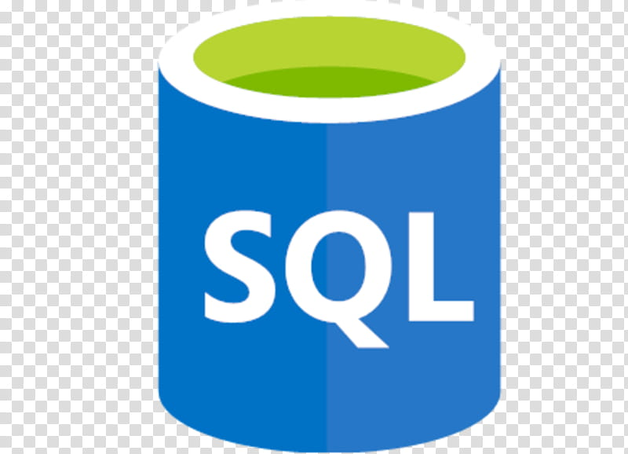
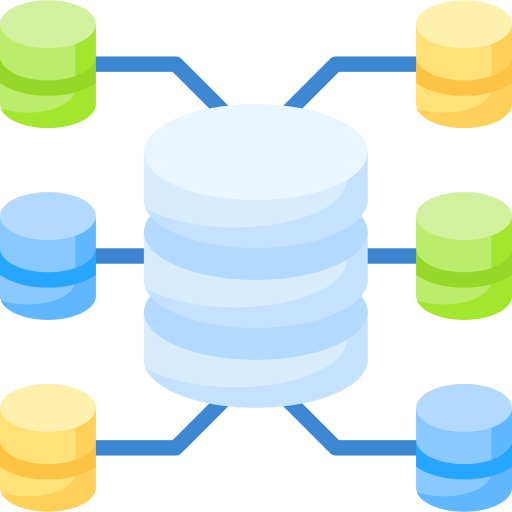

# Hi there, I'm Jisha! 👋
### 📊 Passionate Data Analyst & BI Developer

I am a results-driven **Data Analyst** specializing in transforming raw enterprise data into actionable, strategic business insights. My expertise spans the entire data lifecycle—from designing robust **Data Warehouses** and structuring complex **Data Models** to engineering seamless **ETL pipelines** and building high-impact interactive dashboards.

- 💼 **Current Focus:** Open to new roles / building end-to-end analytics pipelines.
- ⚡ **Core Strength:** Bridging the gap between complex database systems and executive business decisions.
- 💬 **Ask me about:** Relational database optimization, star schemas, or pixel-perfect SSRS reports.

---

## 🛠️ Technical Stack & Ecosystem

### Business Intelligence & Reporting

  <!-- Power BI -->
  
  <!-- SSRS -->
  

### Data Engineering & Databases

  <!-- SSIS -->
  
  <!-- MySQL -->
  
  <!-- Data Warehousing -->
  
  <!-- Data Modelling -->
  

---

## 🏗️ Analytics Architecture Expertise

* **Data Architecture & Warehousing:** Advanced experience building and implementing enterprise-ready architecture. Proficient in **Star Schema** and **Snowflake Schema** configurations, optimizing fact and dimension tables to guarantee lightning-fast analytical query performance.
* **ETL Pipeline Automation:** Skilled at leveraging **SSIS** to construct stable Extract, Transform, and Load flows—automating data integration from disparate transactional sources into clean target environments.
* **Advanced Semantic Modelling:** Specialized in **Power BI dimensional modelling**, writing clean DAX measures (Time Intelligence, calculated metrics), establishing secure Row-Level Security (RLS), and setting up automated gateway refreshes.
* **Enterprise Reporting:** Expert at developing complex, enterprise-grade operational documents using **SSRS**, managing deep parameterized drill-downs, sub-reports, and subscription matrixes.

---

## 📂 Featured Portfolio Projects

### 🚀 [Project 1 Title: Retail Data Analytics Portfolio Project]
* **Description:** An end-to-end data analytics project that transforms raw retail customer shopping data into actionable business insights using SQL, Python, and Power BI, enabling data-driven decision-making through interactive dashboards and analytical reporting.
* **Tech Stack:** Data Analytics Pipeline: SQL → Python → Power BI
* **Key Achievements:** 
  * Cleaned and transformed raw retail datasets using Python (Pandas) to ensure data quality and consistency.
  * Performed advanced data analysis and business queries using SQL to uncover customer shopping trends and sales insights.
  * Built interactive Power BI dashboards to visualize KPIs, customer behavior, product performance, and revenue trends.
  * Delivered an end-to-end analytics workflow from data preprocessing to business intelligence reporting.
### 📂 View the Project
🔗 GitHub Repository: https://github.com/jisha-portfolio/retail-data-analytics

### 📈 [Project 2 Title: e.g., Operational Matrix & Paginated Corporate Reporting]
* **Description:** Developed an enterprise operational matrix tracking financial compliance and performance margins over legacy servers.
* **Tech Stack:** MySQL, SSRS, Data Warehousing.
* **Key Achievements:**
  * Re-architected slow transactional queries with advanced indexing, improving data retrieval efficiency by 35%.
  * Designed automated, pixel-perfect SSRS report deployments with custom scheduling for regional office delivery.

---

## 📈 GitHub Statistics

  
  

---

## 🤝 Connect With Me

  
  

